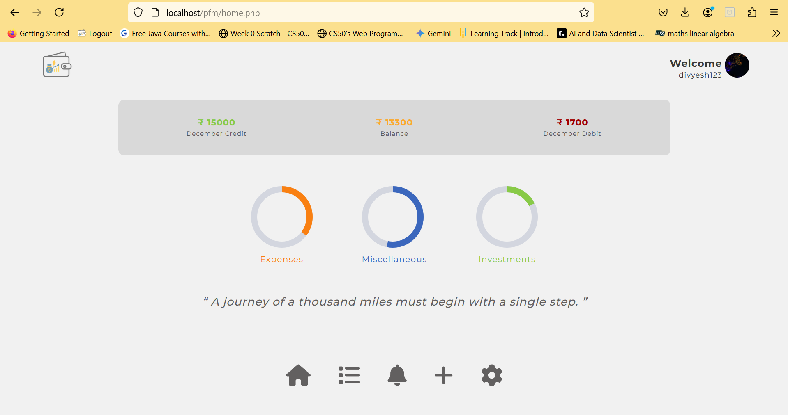

# Personal Finance Management

## Project Description

**Personal Finance Management** is a website designed to help users manage their finances efficiently. It enables users to keep track of their income, expenses, savings, and investments while offering tools for splitting expenses and generating a summarized financial overview. The platform focuses on day-to-day financial activities and provides insightful tools to manage petty expenditures.

Key features include user authentication, theme customization, and daily motivational quotes on personal finance. The website is designed for local hosting and has not been deployed online.

---

## Features

- **Savings Tracking**: Monitor and categorize savings over time.
- **Expense Splitting**: Easily divide expenses among multiple users.
- **Expense Management**: Record and review daily expenditures.
- **Investment Tracking**: Log and evaluate your investment portfolio.
- **User Authentication**: Secure login and logout functionality using RegEx and other Security checks.
- **Settings**:
  - Name Updation
  - Username Updation  
  - Update password
  - Delete account
  - Change theme (Dark/Light mode)
  - Logout
- **Daily Quotes**: Inspirational quotes on personal finance displayed daily.

---

## Technologies Used

- **Frontend**: HTML, CSS, JavaScript
- **Backend**: PHP
- **Database**: MySQL
- **Development Environment**: XAMPP (for local server hosting)

---

## Project Structure

The website is structured for modularity and efficiency:

- **Page-specific Code**: Each page has its own HTML, CSS, and JavaScript files.
- **Common Components**: Shared elements (like headers, footers, and navigation bars) are written separately and included where needed to reduce redundancy.
- **Database Queries**: All MySQL queries are managed within the PHP code for database interactions.
- **Integration**: Pages are connected via `index.php` for seamless navigation and data flow.

---

## Installation and Setup

1. **Download and Install XAMPP**:
   - [Download XAMPP](https://www.apachefriends.org/index.html)
   - Install and start the Apache and MySQL modules.

2. **Clone the Repository**:
   ```bash
   git clone https://github.com/jubiranka/Personal-Finance-Management-Website/tree/main
   ```

3. **Import Database**:
   - Open `phpMyAdmin` (usually accessible via `http://localhost/phpmyadmin/`).
   - Create a new database (e.g., `finance_db`).
   - Import the provided `.sql` file into the database.

4. **Run the Website**:
   - Place the project folder in the `htdocs` directory of XAMPP.
   - Access the website at `http://localhost/personal-finance-management`.

---

## Screenshots

### Dashboard
Overview of savings, expenses, and investments.



### Expense Splitting
User-friendly interface to divide expenses.


### Settings Page
Customizable options for account and theme.


---

## Limitations

- The project is currently designed to run locally and has not been deployed online.
- No real-time notifications or third-party API integrations.

---

## Future Enhancements

- Deploy the website on a public hosting platform.
- Add support for currency conversion and multi-currency tracking.
- Integrate APIs for real-time stock/investment tracking.
- Enhance UI/UX with modern design frameworks.

---

## Acknowledgments

This project was developed as part of a Bachelor’s degree coursework. Special thanks to mentors and peers who provided guidance and feedback throughout the development process.

---

Feel free to contribute to this project by creating pull requests or raising issues for enhancements and bug fixes.
